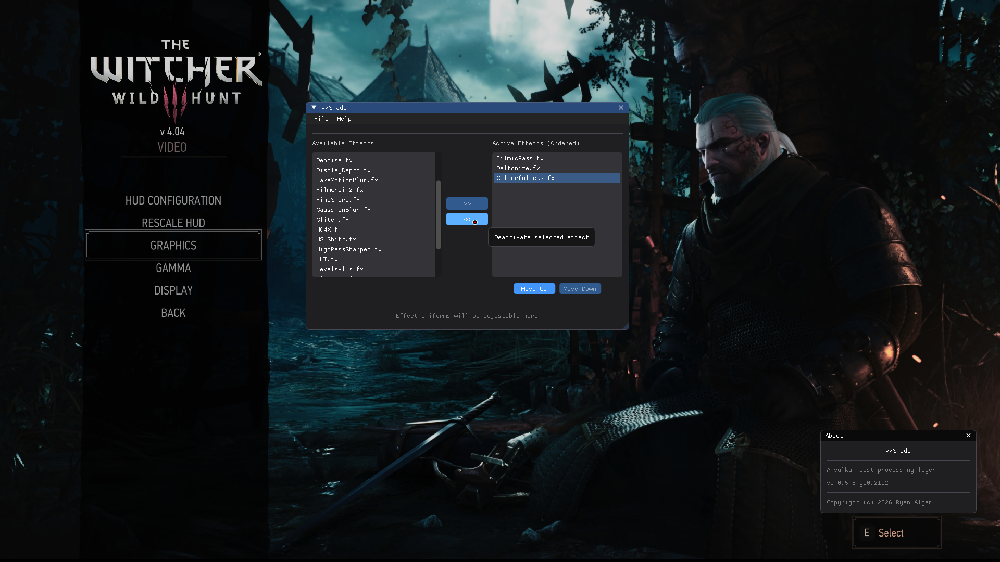

  
    
  
  
  
  
  
  

> [!WARNING]
> This software may trigger anti-cheat systems. Use it with multiplayer games
> at your own risk.

## Overview

<!-- --8<-- [start:overview-text] -->

vkShade is a ReShade-compatible Vulkan post-processing layer, written from the
 ground up to be a powerful, modern, and maintainable solution for improving
 visuals in games and other Vulkan applications on Linux.

<!-- --8<-- [end:overview-text] -->

See the [documentation](https://ralgar.github.io/vkShade) for more information.

  
   
  <em>vkShade overlay running in-game (click to enlarge)</em>

## Project Status

<!-- --8<-- [start:project-status] -->

vkShade is currently in the **PRE-ALPHA** phase of development. The
 core shader runtime and preset system are functional and increasingly
 feature-complete, while the GUI and other user-facing components are still
 under active development. Expect bugs, incomplete features, and breaking
 changes as the project continues to mature.

<!-- --8<-- [end:project-status] -->

See the [documentation](https://ralgar.github.io/vkShade/project-status)
 for current features, limitations, and development status.

## Acknowledgments

Big thanks to the [ReShade] project and the many developers who create effects
 for its ecosystem. ❤️

## License

Copyright (c) 2026 Ryan Algar
 ([ralgar/vkShade](https://github.com/ralgar/vkShade))

BSD 2-clause License (see [LICENSE](LICENSE) or
 [BSD 2-clause](https://choosealicense.com/licenses/bsd-2-clause/))

<!----------------------------------------------------------------------------->

[ReShade]: https://github.com/crosire/reshade
